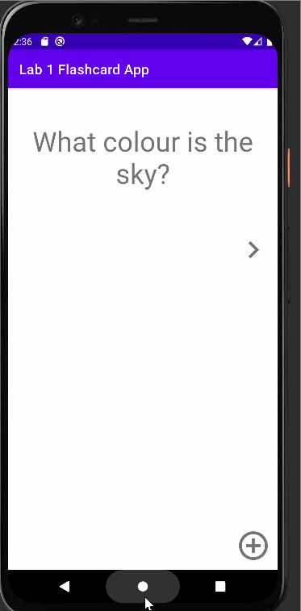

## Lab 4

### App Description
`TODO://` A Flashcard app you can use to study :)

### App Walk-though
A flashcard app that helps you study smarter, not longer.
 

## Required
- [x] Add a view for the front side of the flashcard to display the question
- [x] Add a view for the back side of the flashcard to display the answer
- [x] Build in logic to show the answer side when the card is tapped
- [x] User can click on a ‘+’ button that takes the user to new ‘Add Card Screen’
- [x] The 'Add Card Screen' has a cancel button to take the user back to the main screen
- [x] User can enter and submit a Question and Answer through the 'Add Card Screen'
- [x] User will see the card they just created on the main screen when they press the 'Save Button'
- [x] User can create a card and still see their created card when the app is relaunched.
- [x] User can create muliple cards and browse through all created cards
- [x] User sees a transition animation when going from the main screen to the add card screen.
- [x] User sees a reveal animation when the flashcard is tapped and the answer is shown
- [x] User sees flashcards animating in / out when the 'next' button is tapped